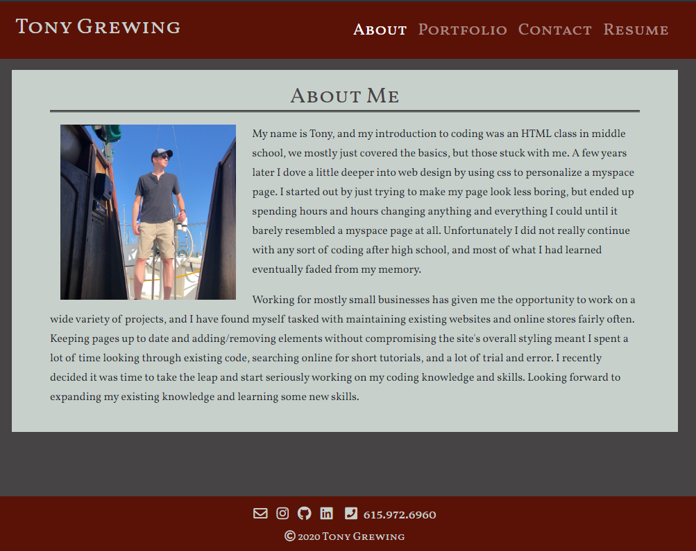

# Tony Grewing's Portfolio
A portfolio site that I will be updating as I finish more projects.

## Demo
[Deployed Site](http://tsgrewing.github.io/)

## Use of Bootstrap and React for general layout
Used bootstrap elements for navbar.
Used grid system to organize main content of each page.
Used a bootstrap form element with minor changes for a contact form.
Used React components for the portfolio page so it is easy to update with new projects.

## Consistent Navbar
Only difference from page to page is which link is highlighted as the active page. 

## Responsive Design
Images and design are responsive to screen size. 
Content has side margins on larger screens, but uses the entire window on smaller screens and devices. 

